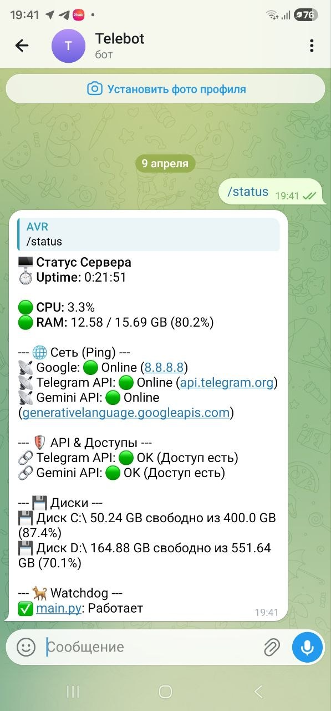

# 🛡️ Telegram Server Monitor Bot


Легковесный, автономный и безопасный Telegram-бот для непрерывного мониторинга и удаленного администрирования серверов. Выполняет функции системного аналитика, сетевого диагноста и цифрового «сторожа» (Watchdog).

Бот отлично подходит для работы как в личных сообщениях с администратором, так и в специализированных командных чатах (группах).

---

## ✨ Ключевые возможности

* 📊 **Анализ ресурсов (System Health):** Отслеживание загрузки CPU, состояния RAM и свободного места на жестких дисках (`C:\`, `D:\`).
* 🌐 **Сетевая диагностика:** Умный ICMP-пинг и проверка HTTP/API эндпоинтов (с выявлением блокировок 403 и лимитов 429).
* 🐕 **Watchdog процессов:** Непрерывный мониторинг критической инфраструктуры (поддержка `.exe`, `.py`, `.bat`). Различает Python-скрипты по аргументам запуска.
* 🔔 **Умные уведомления:** Фоновый цикл с тихими плановыми отчетами и громкими экстренными алертами при падении процессов.
* 📁 **Работа с логами:** Дистанционное получение файлов логов напрямую в Telegram без необходимости RDP/SSH доступа.
* 🔄 **Удаленное управление:** Возможность экстренной перезагрузки сервера.

---

## 🚀 Быстрый старт

### 1. Клонирование и установка зависимостей
Убедитесь, что у вас установлен Python 3.10 или выше.

```bash
git clone [https://github.com/AlekseyVR/Telebot.git](https://github.com/AlekseyVR/Telebot.git)
cd Telebot
python -m venv venv

# Активация окружения (Windows)
venv\Scripts\activate
# Для Linux/macOS: source venv/bin/activate

pip install -r requirements.txt
```

### 2. Настройка безопасности (.env)
Создайте файл `.env` в корне проекта и добавьте ваши секретные ключи. **Этот файл не должен попадать в публичный репозиторий!**

```env
BOT_TOKEN=ваш_токен_от_BotFather
GEMINI_API_KEY=ваш_ключ_от_gemini_api
```

### 3. Конфигурация логики
В корне проекта находится файл-шаблон `config.example.json`. Создайте его копию, переименуйте в `config.json` и укажите свои данные:

**Для Windows (в терминале):**
```cmd
copy config.example.json config.json
```

---

## 🕹️ Доступные команды

Все команды защищены строгой проверкой прав. Бот реагирует только на пользователей из списка `admins`.

| Команда | Описание |
| :--- | :--- |
| `/start` | Проверка авторизации и приветствие. |
| `/help` | Вывод подробной справки по всем функциям бота. |
| `/status` | Принудительная генерация полного среза состояния сервера (Ресурсы, Сеть, Watchdog). |
| `/getlogs` | Отправка файлов логов из конфигурации в виде документов. |
| `/reboot` | Удаленная перезагрузка ПК (выполняется с задержкой 5 сек и оповещением в чат). |

---

## ⚙️ Автозапуск и отказоустойчивость (Windows)

Для обеспечения работы бота 24/7 в проекте предусмотрен скрипт-оболочка `run_monitor.bat`. Он автоматически перезапускает бота в случае критических ошибок сети или падения процесса.

1. Отредактируйте `run_monitor.bat`, указав актуальный путь к проекту.
2. Создайте ярлык для файла `run_monitor.bat`.
3. Нажмите `Win + R`, введите `shell:startup` и нажмите Enter.
4. Поместите ярлык в открывшуюся папку автозагрузки.

---

## 🔒 Безопасность

* Убедитесь, что файлы `.env` и `config.json` добавлены в ваш `.gitignore`.
* В репозитории должен храниться только шаблон конфигурации (например, `config.example.json`).
* Для проверки HTTP-узлов, требующих API-ключи, используйте плейсхолдеры в `config.json` (например, `{GEMINI_API_KEY}`). Бот автоматически подтянет реальный ключ из файла окружения `.env`.

---

## 🖼 Пример работы

Вот как выглядит отчет о статусе сервера (`/status`) в Telegram:



```